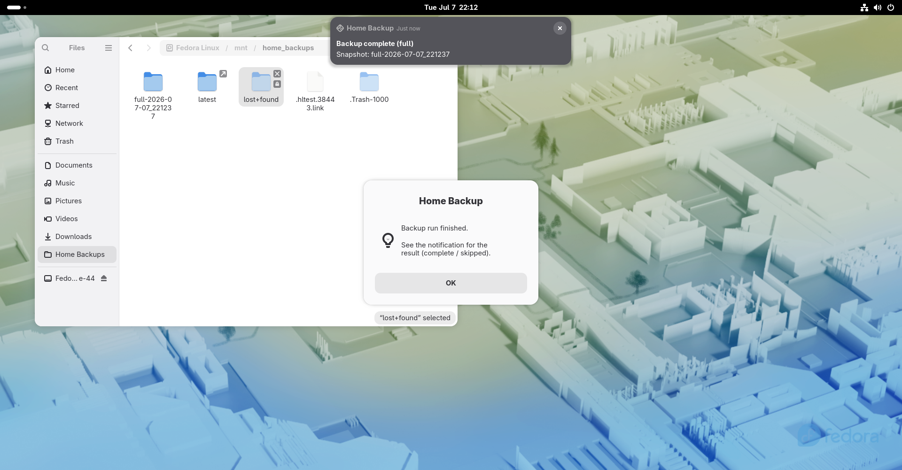

# Home Backup

Simple, robust **rsync snapshot backups** of your home directory to an external
ext4 drive — a full backup plus hard-linked incrementals, scheduled nightly,
with desktop notifications and a one-click **Back Up Now** launcher.

> Status: **pre-1.0** — used and tested; feedback welcome.

## Screenshot


## Features
- **Snapshot backups** via `rsync --link-dest`: every snapshot is a complete,
  browsable tree, but unchanged files are hard-linked so storage stays small.
- **Schedule**: a FULL backup on Monday, INCREMENTAL the other six days.
- **Retention**: incremental snapshots older than 30 days are pruned; fulls kept.
- **Headless-friendly**: a systemd automount (by UUID) mounts the drive on demand
  at `/mnt/home_backups`, so nightly `cron` works even without a desktop session.
- **Safe**: skips cleanly when the drive is absent; refuses read-only / optical /
  non-writable targets; never touches internal/system or `fedora*` partitions;
  only formats a drive after explicit confirmation.
- **Desktop integration**: completion/failure notifications, a Nautilus bookmark,
  and a "Back Up Now" application launcher with icon.

## Components
- `home-backup.sh` — the backup engine (run by cron; reads `~/.config/home-backup/config`).
- `install-home-backup.sh` — installer: detects the drive, writes the config,
  installs the engine + cron entry + launcher, and shows a graphical summary.
- `setup-automount.sh` — root helper: optionally formats the drive ext4, sets
  ownership, adds the `/etc/fstab` systemd automount, and a Nautilus bookmark.
- `backup-now.sh` — GUI wrapper behind the "Back Up Now" launcher.
- `vm-install.sh` — one-shot bootstrap for a fresh Fedora VM (deps, SSH clone, setup + installer).
- `home-backup.excludes` — default rsync exclude patterns (caches, `*.iso`, Trash…).
- `home-backup.png` — launcher icon.

## Requirements
Fedora/Linux with: `bash`, `rsync`, `cron` (cronie), `util-linux`
(`findmnt`, `lsblk`, `flock`), and optionally `zenity` + `libnotify`
(`notify-send`) for the graphical bits.

## Install
```bash
# 1) install the engine, config, cron entry, and launcher (per-user)
./install-home-backup.sh

# 2) prepare the drive: automount + ownership (and format to ext4 if needed)
sudo ./setup-automount.sh
```
The installer only prompts if it cannot determine the backup drive on its own.
`setup-automount.sh` asks for explicit confirmation before formatting anything.

### Fresh Fedora VM (one-shot bootstrap)
On a new Fedora VM, `vm-install.sh` does it all in one pass — installs
dependencies, clones the repo over SSH, runs `setup-automount.sh`, then the
per-user installer:
```bash
./vm-install.sh
```
> **Before running:** attach the backup drive and make sure its ext4 partition
> is **labelled `Storage`**. A fresh VM has no config yet, so `setup-automount.sh`
> locates the drive by that label (it offers to format a non-ext4 drive after you
> confirm). The SSH clone needs your GitHub SSH key set up.

## How it works
- **Source**: your entire `$HOME`, minus the patterns in `home-backup.excludes`.
- **Destination**: `/mnt/home_backups/` — snapshots named `full-YYYY-mm-dd_HHMMSS`
  and `inc-YYYY-mm-dd_HHMMSS`, plus a `latest` symlink to the newest snapshot.
- **When**: nightly at 02:00 (change with `crontab -e`).
- The first run is always a FULL. If the drive is missing at run time, the run is
  skipped and logged (with a desktop notification).

## Manual backup
Launch **Back Up Now** from your applications (or run `~/.local/bin/backup-now.sh`).
It shows a progress dialog and reports the result via notification.

## Restore
Snapshots are plain directories — copy files straight out of any snapshot, e.g.
the most recent one at `/mnt/home_backups/latest/`.

## Logs
`~/.local/state/home-backup/backup.log` (and `cron.log` for scheduled runs).

## License
GPLv3 — see [LICENSE](LICENSE).
